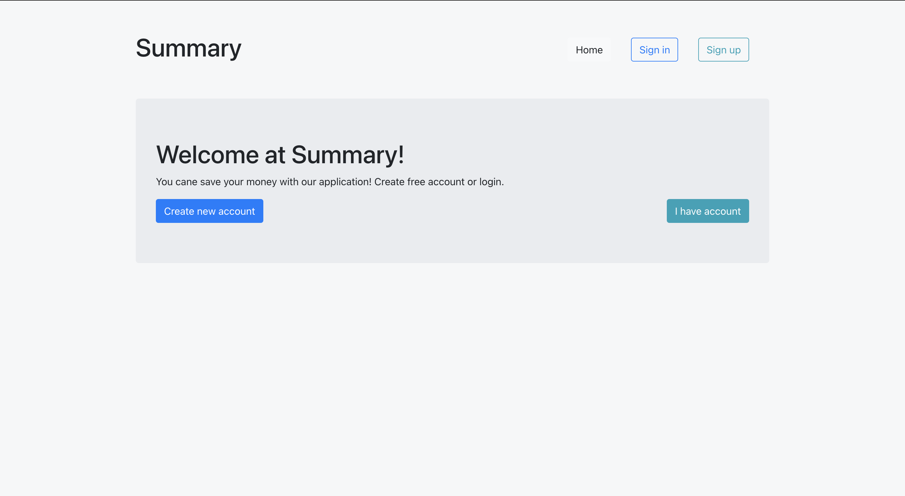
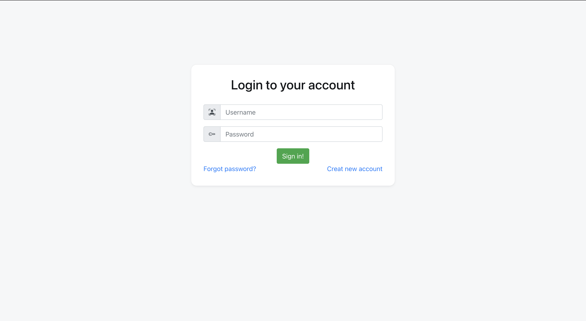
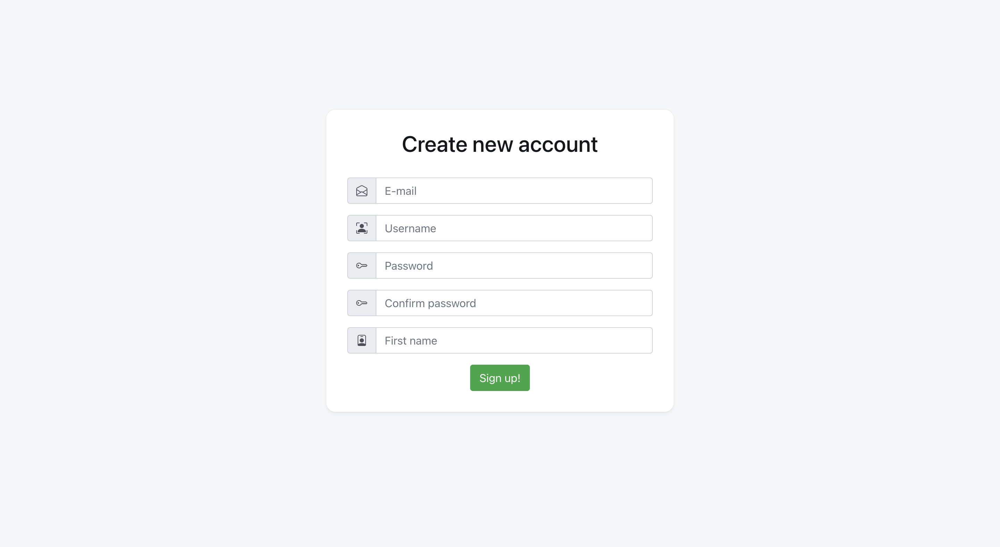
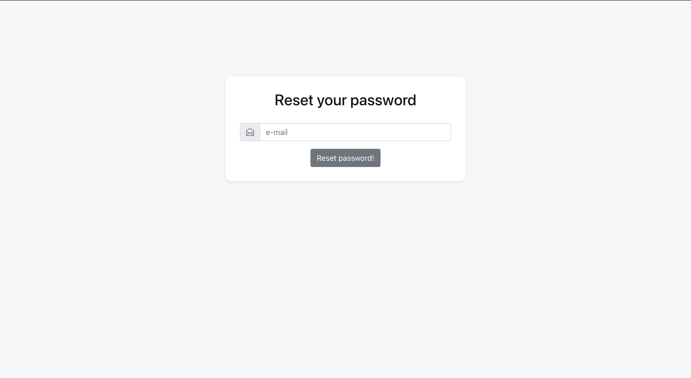
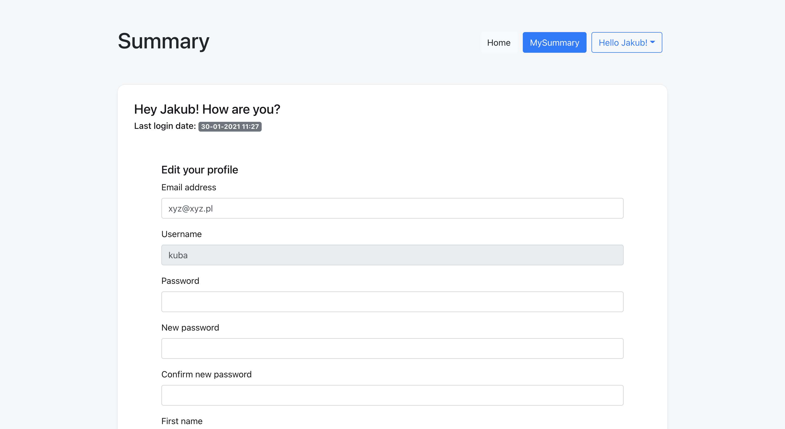
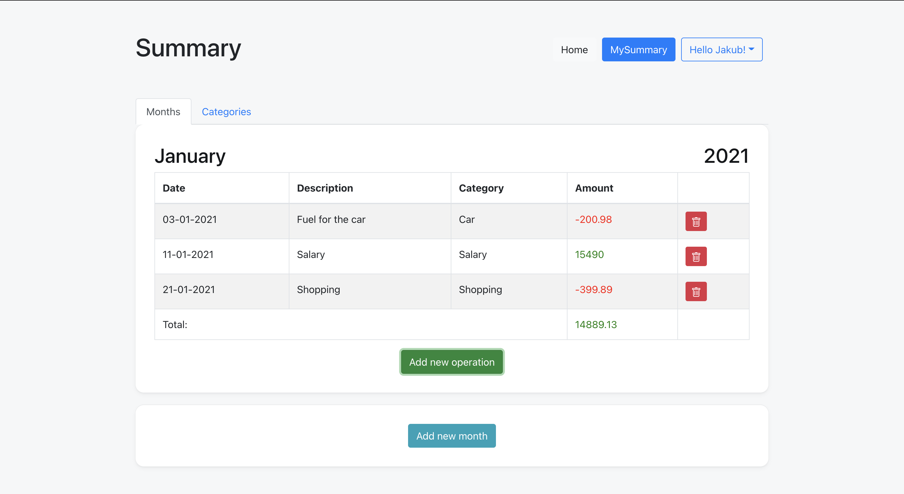
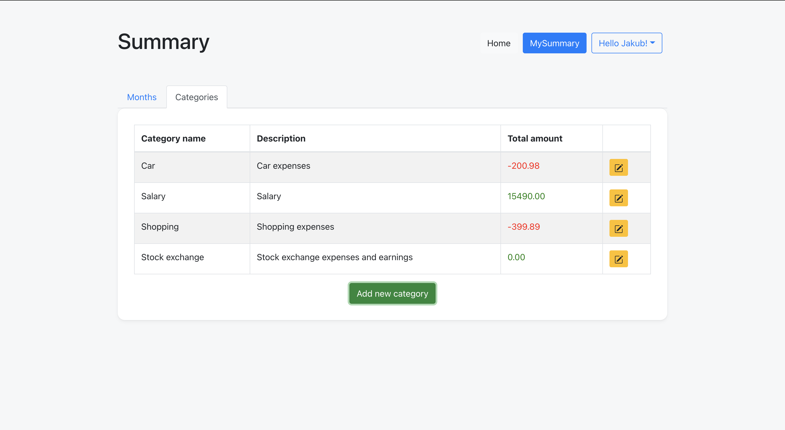

# Summary Application

## About project 
...

## Used technologies 
* ### Frontend 
  * React
  * Axios
  * Styled Components
  * React Form
  * React Bootstrap 
  * React Context

* ### Backend 
  * Spring Boot 
  * Spring Security 
  * JWT
  * Hibernate 
  * MySQL
  * AOP
  * Unit test
  * Integration testing

## Screens from application
* Home
  
* Login
  
* Register
  
* Reset password
  
* User profile
  
* Summary
  * Months
    
  * Categories 
    

